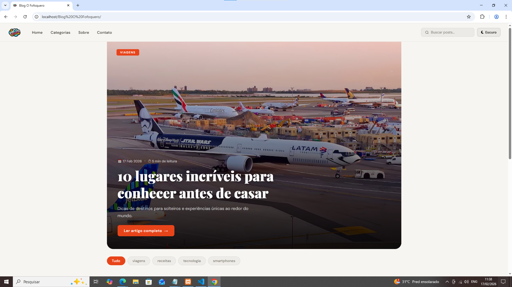
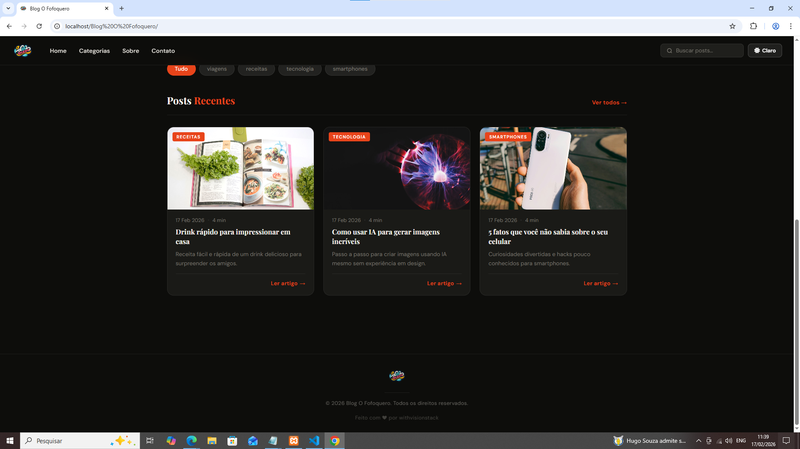
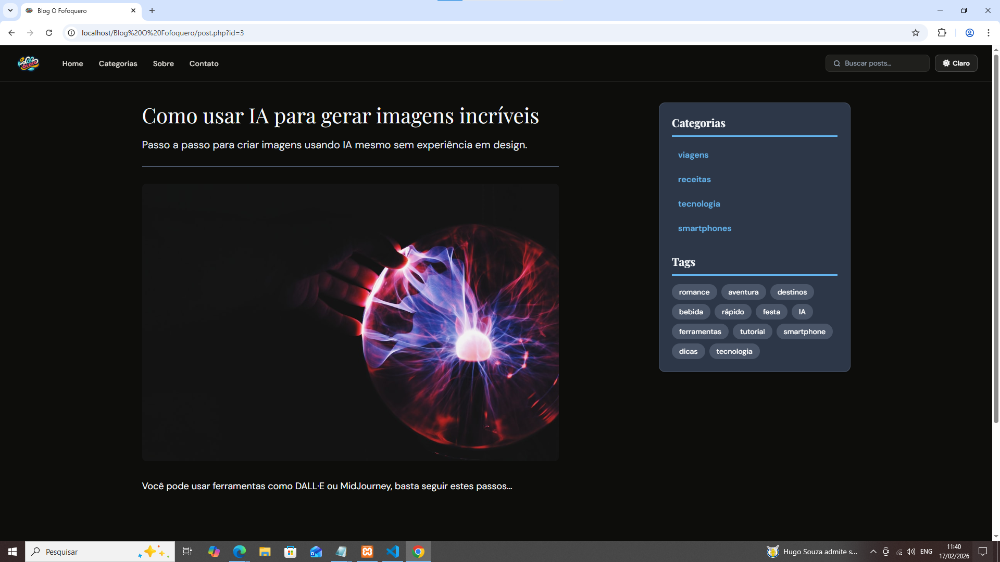
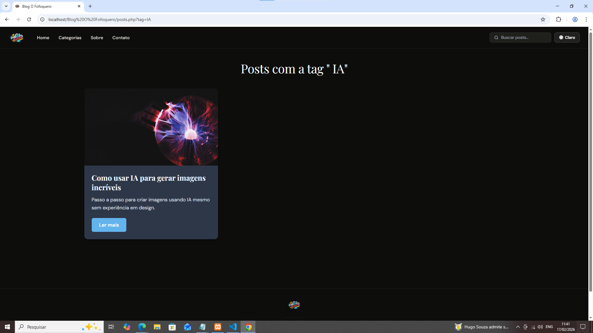
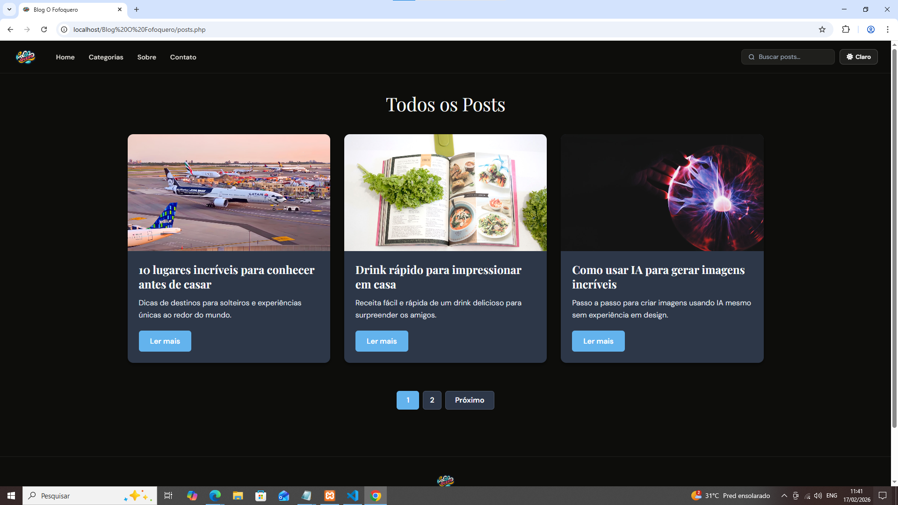

# 📰 Blog PHP — Mock Data


> Blog simples feito com PHP puro, dados mockados e integração com a API do Unsplash para imagens dinâmicas por categoria.

---

## 🖥️ Screenshots

**Home — Hero + Filtros**


**Home — Posts Recentes (Dark Mode)**


**Post Individual com Sidebar**


**Listagem por Tag**


**Todos os Posts com Paginação**


---

## 📋 Sobre o Projeto

Este é um projeto de blog estático desenvolvido com PHP, sem banco de dados. Todo o conteúdo (posts, categorias e tags) é gerenciado por arquivos de dados mockados, tornando o projeto ideal para aprendizado e prototipação rápida.

---

## 🚀 Funcionalidades

- **Página inicial (index)** com post em destaque (hero) e grade de posts recentes
- **Listagem de posts (`posts.php`)** com filtro por categoria e tag, além de paginação
- **Página de post individual (`post.php`)** com conteúdo completo, sidebar de categorias e tags
- **Página de contato (`contato.php`)**
- **Filtro por categoria** via pills interativos na home (JavaScript)
- **Imagens dinâmicas** buscadas via API do Unsplash por categoria, com cache implementado

---

## 🗂️ Estrutura do Projeto

```
/
├── index.php           # Página inicial com hero e cards
├── posts.php           # Listagem com filtros e paginação
├── post.php            # Visualização de post individual
├── contato.php         # Página de contato
│
├── data/
│   ├── posts.php       # Array de posts mockados
│   └── conteudos.php   # Conteúdo completo de cada post
│
├── services/
│   └── unplash.php     # Integração com a API do Unsplash
│
├── templates/
│   ├── header.php      # Cabeçalho/nav reutilizável
│   └── footer.php      # Rodapé reutilizável
│
├── css/
│   ├── styles.css      # Estilos globais da aplicação
│   ├── post.css        # Estilos da página de post
│   └── posts.css       # Estilos da listagem de posts
│
├── js/
│   ├── menu.js         # Lógica do menu de navegação (mobile/toggle)
│   └── filter.js       # Filtro de categorias por pills (client-side)
│
└── cache/
    └── *.json          # Cache local das respostas da API do Unsplash (TTL: 1h)
```

---

## ⚙️ Requisitos

- PHP 7.4 ou superior
- Servidor web (Apache, Nginx) ou PHP built-in server
- Chave de API do [Unsplash](https://unsplash.com/developers) *(para imagens)*

---

## 🛠️ Como Rodar Localmente

**1. Clone o repositório:**
```bash
git clone https://github.com/seu-usuario/seu-repo.git
cd seu-repo
```

**2. Configure a chave da API do Unsplash:**

Abra o arquivo `services/unplash.php` e insira sua chave:
```php
define('UNSPLASH_ACCESS_KEY', 'sua_chave_aqui');
```

**3. Suba o servidor local:**
```bash
php -S localhost:8000
```

**4. Acesse no navegador:**
```
http://localhost:8000
```

---

## 📦 Dados Mockados

Os posts são definidos em `data/posts.php` como um array associativo com os campos:

| Campo       | Tipo     | Descrição                        |
|-------------|----------|----------------------------------|
| `id`        | int      | Identificador único do post      |
| `titulo`    | string   | Título do post                   |
| `descricao` | string   | Descrição/resumo                 |
| `categoria` | string   | Categoria principal              |
| `tags`      | array    | Lista de tags relacionadas       |

O conteúdo completo de cada post fica em `data/conteudos.php`, indexado pelo `id` do post.

---

## 🖼️ Integração com Unsplash

A função `buscarImagemPorCategoria($categoria)` em `services/unplash.php` busca uma imagem relevante para cada categoria de post.

Para evitar requisições desnecessárias à API, as respostas são salvas localmente na pasta `cache/` em formato JSON com validade de **1 hora**. Após esse período, o cache expira e uma nova requisição é feita automaticamente.

> ⚠️ Certifique-se de que a pasta `cache/` existe e tem permissão de escrita:
> ```bash
> mkdir cache && chmod 755 cache
> ```

---

## 📄 Licença

Este projeto está sob a licença MIT. Sinta-se livre para usar, modificar e distribuir.
